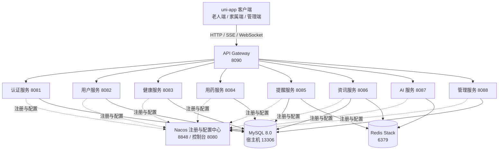

# 老年护理云平台

基于 Spring Cloud 与 uni-app 构建的智慧养老全栈项目，为老人、家属和管理人员提供健康记录、用药管理、提醒通知、健康资讯与 AI 健康问答等能力。

> 项目用于微服务架构学习与功能展示。健康分析和 AI 回答仅供参考，不能替代医生诊断或专业医疗建议。

## 项目概览

- **老人端**：维护个人资料，记录健康指标，管理用药计划，完成服药打卡，阅读健康资讯并使用 AI 助手。
- **家属端**：通过绑定关系查看老人信息、健康趋势和用药情况，协助进行远程关怀。
- **管理端**：维护疾病字典、系统配置和健康资讯等运营内容。
- **服务端**：按认证、用户、健康、用药、提醒、资讯、AI 和管理领域拆分微服务，通过网关统一访问。

## 核心能力

| 领域 | 能力 |
| --- | --- |
| 身份认证 | 手机号注册与登录、短信验证码、密码管理、JWT 无状态认证 |
| 用户关系 | 老人档案、家属绑定与解绑、二维码生成与解析 |
| 健康管理 | 血压、血糖、心率、体重记录，历史查询、趋势统计和异常提醒 |
| 用药管理 | 用药计划、今日用药、服药与漏服记录、历史记录 |
| 智能提醒 | 定时扫描提醒任务、通知记录、WebSocket 实时推送 |
| 健康资讯 | 文章发布、查询、搜索、推荐、点赞和收藏 |
| AI 助手 | 基于 SSE 的流式问答、用药建议、RAG 知识库检索与文档管理 |
| 系统管理 | 疾病字典和系统配置维护 |

## 技术栈

### 后端

| 类别 | 技术与版本 |
| --- | --- |
| 基础环境 | Java 17、Maven Wrapper |
| 核心框架 | Spring Boot 3.5.11、Spring Cloud 2025.0.2 |
| 微服务治理 | Spring Cloud Alibaba 2025.0.0.0、Nacos 3.2.1、OpenFeign、LoadBalancer |
| 数据访问 | MyBatis-Plus 3.5.9、MySQL 8.0 |
| 缓存与检索 | Redis Stack 7.4、RediSearch |
| 安全认证 | Spring Security、JWT（JJWT 0.12.6） |
| AI 能力 | LangChain4j、DashScope、WebFlux、SSE、RAG |
| 实时通信 | Jakarta WebSocket、Spring Scheduling |
| 基础设施 | Docker Compose |

### 前端

前端位于 [`elder_care/`](./elder_care)，采用 uni-app 与 Vue 3 开发，包含 Pinia 状态管理、统一请求封装和多角色页面，可通过 HBuilderX 构建为 H5、微信小程序或 App。

## 系统架构



网关从 Nacos 加载路由，并校验受保护接口的 JWT。认证成功后，用户信息会通过请求头传递给下游服务；服务间调用使用 OpenFeign。

## 模块说明

| 模块 | 端口 | 路由前缀 | 职责 |
| --- | ---: | --- | --- |
| `elderly-gateway` | 8090 | `/` | 统一入口、动态路由、JWT 校验 |
| `elderly-auth` | 8081 | `/auth/**` | 注册、登录、资料与密码管理 |
| `elderly-user` | 8082 | `/user/**` | 老人档案、家属关系与二维码 |
| `elderly-health` | 8083 | `/health/**` | 健康记录、趋势、统计与预警 |
| `elderly-medicine` | 8084 | `/medicine/**`、`/record/**` | 用药计划和服药记录 |
| `elderly-remind` | 8085 | `/remind/**` | 提醒任务、通知与 WebSocket 推送 |
| `elderly-news` | 8086 | `/health-knowledge/**` | 健康资讯、搜索、点赞和收藏 |
| `elderly-ai` | 8087 | `/ai/**` | 流式问答、RAG 与知识库管理 |
| `elderly-admin` | 8088 | `/admin/**` | 系统配置和疾病字典 |

公共能力集中在 `elderly-common/`：

- `common-core`：统一响应、异常处理和通用工具。
- `common-security`：JWT、Spring Security 配置与 Feign Token 转发。
- `common-redis`：Redis 配置和缓存工具。
- `common-mybatis`：MyBatis-Plus 配置与字段自动填充。

## 快速开始

### 1. 环境要求

- JDK 17
- Docker 与 Docker Compose
- Git
- HBuilderX（需要运行前端时）
- DashScope API Key（需要运行 AI 服务时）

项目已包含 Maven Wrapper，无需单独安装 Maven。

### 2. 获取代码

```bash
git clone https://github.com/ZJBSQH/elderly-care.git
cd elderly-care
```

### 3. 配置环境变量

复制示例配置：

```bash
cp .env.example .env
```

Windows PowerShell：

```powershell
Copy-Item .env.example .env
```

按需修改 `.env` 中的数据库、Redis 和 JWT 配置。生产或公开环境必须替换默认密码与 `JWT_SECRET`，且不要提交 `.env` 文件。

如需启动 AI 服务，请额外设置：

```bash
export AI_DASHSCOPE_API_KEY="your-api-key"
```

PowerShell 可使用：

```powershell
$env:AI_DASHSCOPE_API_KEY = "your-api-key"
```

### 4. 启动基础设施

```bash
docker compose up -d
docker compose ps
```

默认访问地址：

| 服务 | 地址 |
| --- | --- |
| Nacos 控制台 | <http://localhost:8080/> |
| Nacos 服务端口 | `localhost:8848` |
| MySQL | `localhost:13306` |
| Redis | `localhost:6379` |

MySQL 首次启动时会执行 [`init-sql/`](./init-sql) 中的初始化脚本。

### 5. 发布 Nacos 配置

各微服务会从 Nacos 的 `dev` 命名空间读取配置，当前应用配置使用的命名空间 ID 为 `95fa0605-69e9-4b3b-8ecb-24feb2e63db3`。首次运行前，请根据 [`nacos-configs/`](./nacos-configs) 中每个文件头部标注的 Data ID 和 Group，将配置内容发布到该命名空间；例如：

- `elderly-care-cloud-shared.txt` → `elderly-care-cloud-shared.yaml`
- `elderly-gateway.txt` → `elderly-gateway.yaml`
- `elderly-auth.txt` → `elderly-auth.yaml`

其余服务配置按相同规则发布，Group 均为 `DEFAULT_GROUP`。

### 6. 编译后端

Linux/macOS：

```bash
./mvnw clean install -DskipTests
```

Windows：

```powershell
.\mvnw.cmd clean install -DskipTests
```

### 7. 启动微服务

可在 IDE 中分别运行各模块的 `*Application` 启动类，也可以在独立终端中使用 Maven Wrapper。例如：

```bash
./mvnw -pl elderly-auth spring-boot:run
./mvnw -pl elderly-user spring-boot:run
./mvnw -pl elderly-gateway spring-boot:run
```

建议先启动业务服务，再启动 `elderly-gateway`。全部服务注册成功后，通过 `http://localhost:8090` 访问网关。

### 8. 运行前端

使用 HBuilderX 打开 [`elder_care/`](./elder_care)，选择“运行”或“发行”到目标平台。前端请求配置位于 `elder_care/utils/`，接口封装位于 `elder_care/api/`。

## API 概览

所有 HTTP 接口建议通过网关 `http://localhost:8090` 访问。

| 接口组 | 示例 |
| --- | --- |
| 认证 | `POST /auth/sms`、`POST /auth/register`、`POST /auth/login` |
| 用户关系 | `POST /user/family/bind`、`GET /user/family/elders` |
| 健康数据 | `POST /health/record`、`GET /health/history`、`GET /health/trend` |
| 用药计划 | `POST /medicine/add`、`GET /medicine/plan/{elderId}` |
| 服药记录 | `POST /record/take`、`GET /record/history` |
| 提醒通知 | `GET /remind/task/today`、`GET /remind/notification/list` |
| 健康资讯 | `GET /health-knowledge/articles`、`GET /health-knowledge/search` |
| AI 与知识库 | `POST /ai/rag/ask`、`POST /ai/kb/document` |
| 系统管理 | `GET /admin/system/configs`、`GET /admin/disease/list` |

除登录、注册、短信、密码重置、AI 问答和公开资讯等开放路径外，请求通常需要携带 JWT：

```http
Authorization: Bearer <token>
```

提醒服务的 WebSocket 端点为 `ws://localhost:8085/ws/notify/{userId}`。

## 项目结构

```text
elderly-care/
├── elder_care/                 # uni-app 前端
├── elderly-common/             # 公共基础模块
├── elderly-gateway/            # API 网关
├── elderly-auth/               # 认证服务
├── elderly-user/               # 用户与家属关系服务
├── elderly-health/             # 健康管理服务
├── elderly-medicine/           # 用药管理服务
├── elderly-remind/             # 提醒与通知服务
├── elderly-news/               # 健康资讯服务
├── elderly-ai/                 # AI 与 RAG 服务
├── elderly-admin/              # 管理服务
├── init-sql/                   # MySQL 初始化脚本
├── nacos-configs/              # Nacos 配置模板
├── docker-compose.yml          # 本地基础设施编排
├── .env.example                # 环境变量示例
└── pom.xml                     # Maven 父工程
```

## 安全与数据说明

- 网关统一解析 JWT，并向下游传递用户身份信息。
- 各业务服务使用独立数据库，跨服务关系以业务 ID 关联。
- 服务间调用通过 Feign 转发 Bearer Token。
- 密码使用 BCrypt 哈希存储。
- 默认配置仅适合本地开发，部署前必须更换数据库密码、JWT 密钥和第三方 API Key。
- `mysql-data/`、`redis-data/`、`.env` 等运行数据与敏感配置已被 Git 忽略。

## 贡献

欢迎通过 Issue 提交问题或建议。提交代码前，请确保改动聚焦、配置中不包含密钥，并完成相关模块的构建验证。

## 作者与使用说明

作者：**郑**

本仓库目前用于学习与展示，尚未提供独立的开源许可证文件。未经明确授权，请勿将项目用于生产环境或商业分发。
